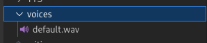
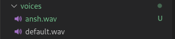

# Style TTS Server

We have developed a Text-to-Speech (TTS) system utilizing [StyleTTS2](https://github.com/yl4579/StyleTTS2) , which can efficiently process and `serve 100 characters in just 410 milliseconds` on an AWS G5 large instance. This system is implemented as a simple HTTP server, enabling straightforward integration and usage. With our TTS system, users can leverage advanced features of StyleTTS2, such as voice cloning and text-to-audio conversion. This allows for the creation of high-quality, natural-sounding audio from text input with remarkable speed and accuracy, making it a powerful tool for various applications.


### Installation
```shell
python3 -m venv env
. ./env/bin/activate
pip install -r requirements.txt
```
### Start Server
```shell
python3 main.py
```
by default it use's port `8700`

### Making API call
```python
import requests
import json
from base64 import b64decode
headers = {
    'accept': 'application/json',
    'Content-Type': 'application/json',
}

json_data = {
    'text': 'hello world i am R Ansh Joseph whats your name',
    'rate':8000,
    'voice_id': 'default',
    'alpha': 0.3,
    'beta': 0.7,
    'diffusion_steps': 5,
    'embedding_scale': 1,
}
import time
prev = time.time()
response = requests.post('http://127.0.0.1:8700/tts', headers=headers, json=json_data)
response = json.loads(response.text)
print(time.time() - prev)
with open("audio.wav",'wb') as file:
    file.write(b64decode(response['audio']))
```
<b>note:- you can change the audio sample rate by changing the rate in json_data and you can change the voice by altering voice_id</b>

### Adding More Voice's
to add more voice you have to `put audio file to voices dir` and file name is voice_id for that voice

For Example



by default we have a default.wav in voices folder but if you have to add new voice you have put a new audio file in this folder , some thing like this



now if you want to access new audio you have to simply you this payload according to this example

```python
json_data = {
    'text': 'hello world i am R Ansh Joseph whats your name',
    'rate':8000,
    'voice_id': 'ansh',
    'alpha': 0.3,
    'beta': 0.7,
    'diffusion_steps': 5,
    'embedding_scale': 1,
}
```
<b>note: if you add new voice at the time server is on then restart the server</b>

`FOR SINGLE WORD MODEL CREATE WEIRD SOUND`
